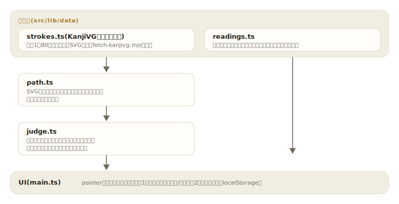

# kakitori

[](https://github.com/miruky/kakitori/actions/workflows/ci.yml)
[](https://github.com/miruky/kakitori/actions/workflows/deploy.yml)
[](https://www.typescriptlang.org/)
[](LICENSE)

**小学1年の漢字80字を、指やマウスの手書きと筆順つきストローク判定で練習する書き取りトレーニング**

デモ: https://miruky.github.io/kakitori/

## 概要

kakitoriは、画面のマスに1画ずつ漢字を書いて練習するWebアプリである。1画書き終えるたびに、その線が手本の何画目と合っているかを判定する。書き始め・書き終わりの位置、線の形、長さを照合し、ずれていれば「書き始めの位置が違う」のように理由つきで突き返す。筆順どおりでないと先に進めないため、形だけでなく書き順が身につく。

モードは2つある。なぞり練習は薄い手本の上をなぞる形式で、次に書く画の起点が点滅し、2回続けて間違えると正しい画が自分で描かれるヒントが出る。暗書きテストは手本なしで、「みぎてを あげる」のようなかな書きの用例と読みだけを見て書く。合格(ミス2回以内)した字は一覧に印がつき、進み具合はlocalStorageに保存される。

筆順データはKanjiVGのSVGパスを使う。手書きの判定は、SVGパスを折れ線に展開し、弧長で等間隔の32点に取り直してから、手本と対応する点どうしの距離を測る方式で行う。逆順に書いた線は対応点が大きくずれるため、特別な処理なしに自然に弾かれる。

### なぜ作ったのか

筆順を確認できるサイトはアニメーションを見せるものが多く、「見る」と「書ける」の間には距離がある。実際に手を動かして、間違えた瞬間にどこが違うかを言ってもらえる道具が欲しかった。タブレットでの利用を想定してポインタイベントで実装し、指でもスタイラスでもマウスでも同じように書ける。

## アーキテクチャ



## 技術スタック

| カテゴリ             | 技術                                    |
| :------------------- | :-------------------------------------- |
| 言語                 | TypeScript 5(strict、実行時依存ゼロ)    |
| 筆順データ           | KanjiVG(CC BY-SA 3.0、生成物として同梱) |
| ビルド               | Vite 8                                  |
| テスト               | Vitest(node環境)                        |
| リンタ・フォーマッタ | ESLint(typescript-eslint)+ Prettier     |
| CI / 配信            | GitHub Actions / GitHub Pages           |

## 使い方

### 手書きの線を判定する

```ts
import { judgeStroke, kanjiData } from './src/lib';

const ichi = kanjiData.find((k) => k.char === '一');
const verdict = judgeStroke(
  [
    { x: 14, y: 55 },
    { x: 60, y: 54 },
    { x: 96, y: 52 },
  ],
  ichi!.strokes[0]!,
);
// verdict.ok            => true(多少のずれは許容)
// verdict.avgDistance   => 手本との平均距離(viewBox座標)
// verdict.reason        => 不合格時は 'start' | 'end' | 'shape' | 'length' | 'too-short'
```

### パスの展開とリサンプリング

```ts
import { pathToPolyline, resample } from './src/lib';

const pts = pathToPolyline('M0,0 C0,10 10,10 10,0'); // ベジェを折れ線へ
const even = resample(pts, 32); // 弧長で等間隔の32点に
```

判定のしきい値は子どもの手書きを想定してやや緩めに取ってある(平均距離13・端点20・長さ比0.45〜2.2、いずれもviewBox 109に対する値)。

## プロジェクト構成

- `src/lib/data/strokes.ts` 80字の筆順つきSVGパス(KanjiVG由来の生成物。手で編集しない)
- `src/lib/data/readings.ts` 読みと、答えの漢字を含まないかな書きの用例
- `src/lib/path.ts` SVGパスの折れ線展開と弧長リサンプリング
- `src/lib/judge.ts` 1画ぶんの手書き判定と不合格理由
- `src/lib/progress.ts` モード別の習熟記録
- `src/main.ts` 手書きボード・モード切替・字の一覧のUI
- `scripts/fetch-kanjivg.mjs` KanjiVGからデータを再生成するスクリプト
- `docs/` アーキテクチャ図

## はじめ方

### 前提条件

- Node.js 22以上

### セットアップ

```bash
git clone https://github.com/miruky/kakitori.git
cd kakitori
npm ci
npm run dev
```

筆順データは生成物としてコミット済みで、ビルドにネットワークは要らない。データを作り直す場合だけ `node scripts/fetch-kanjivg.mjs` を実行する。

### テスト・lint・ビルド

```bash
npm test
npm run lint
npm run build
```

テストには「全80字・全画で手本どおりの線が合格する」自己一致検査を含む。判定のしきい値を変えたときの退行をここで検出する。

### デプロイ

mainへのpushで `deploy.yml` がGitHub Pagesへ公開する。サブパス配信のためのbaseは環境変数 `KAKITORI_BASE` で渡す。

## 制約

- 収録は小学1年配当の80字のみ。とめ・はね・はらいの細部は判定せず、画の位置と形だけを見る。
- 判定は1画単位で、画をつなげて書いた場合(連筆)は不合格になる。
- 暗書きテストの読みと用例は代表的なもの1つに絞っており、すべての読みは載せていない。
- キーボードだけでの操作には対応していない(手書きが本質のため)。字の選択とボタン操作はキーボードでできる。

## 設計方針

- **間違いには理由を返す** — 不合格を「ばつ」で終わらせず、書き始め・書き終わり・形・長さのどれが違うかを言葉で返す。直し方が分かる失敗だけが練習になる。
- **判定器は純関数** — 手書き判定はDOMに依存しない `(点列, 手本) -> 判定` の関数で、全80字の自己一致や逆順の棄却をテストで保証する。
- **データは生成物として固定する** — KanjiVGからの変換はスクリプトに分離し、結果をコミットする。CIと利用者のビルドはネットワークに依存しない。
- **緩すぎず、厳しすぎず** — しきい値は「雑に書いても通る」と「丁寧に書いても落ちる」の間を実書きで調整した値で、定数として1か所にまとめてある。

## ライセンス

このリポジトリのコードは [MIT](LICENSE)。

筆順データ(`src/lib/data/strokes.ts`)は [KanjiVG](https://kanjivg.tagaini.net/)(Ulrich Apel氏)に由来し、Creative Commons BY-SA 3.0で提供される。
